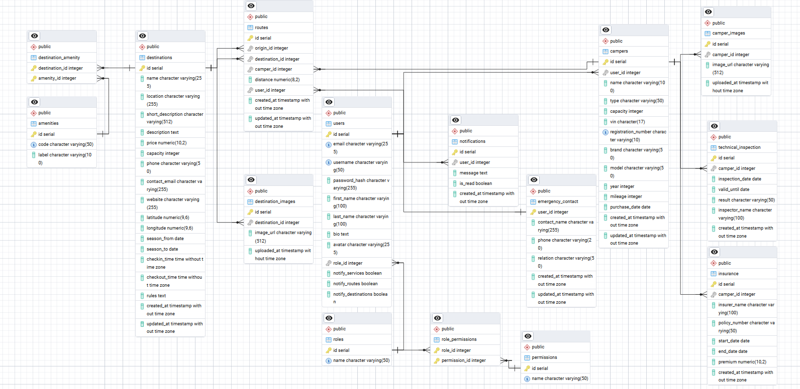
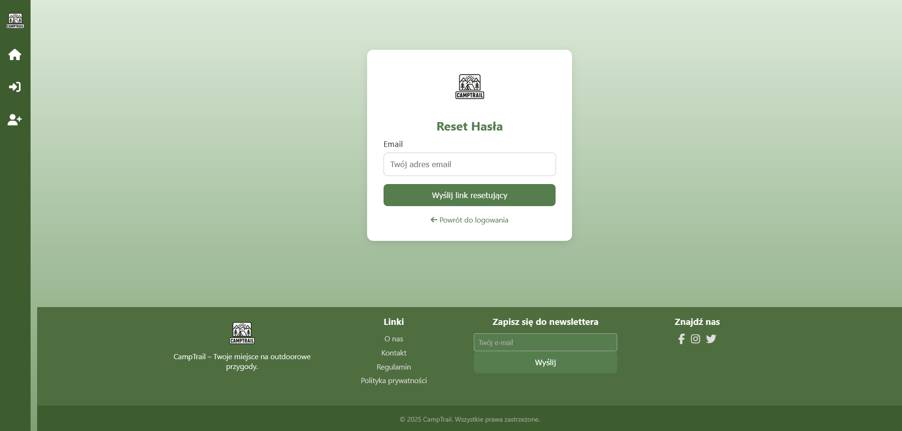
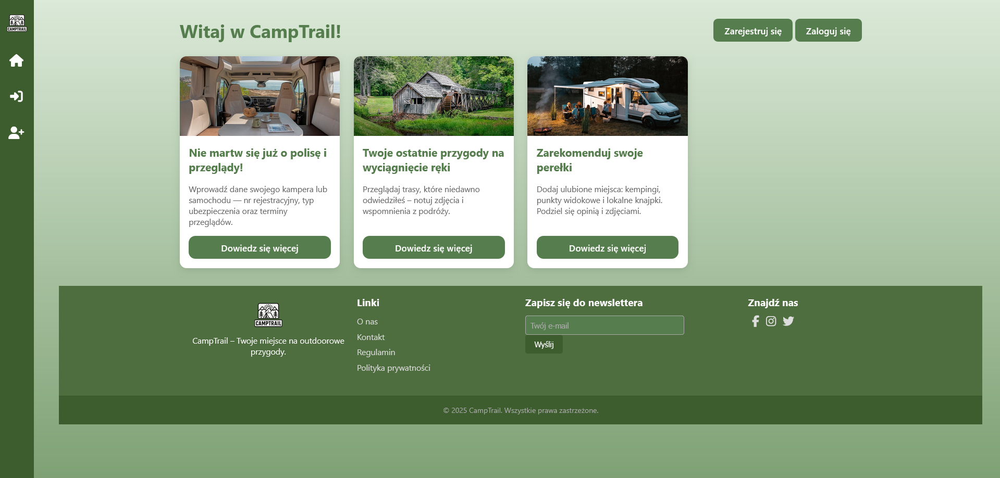
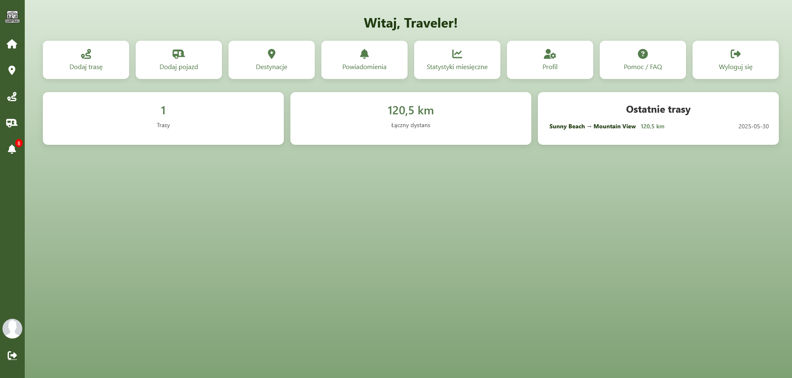
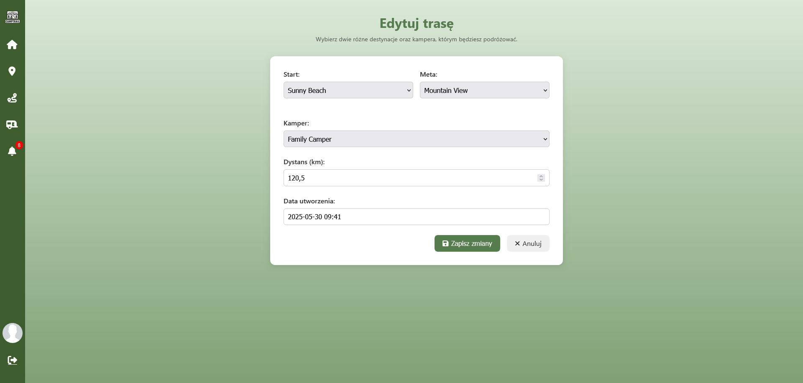
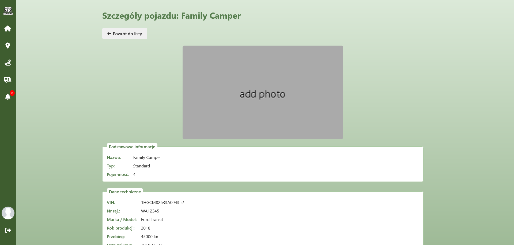
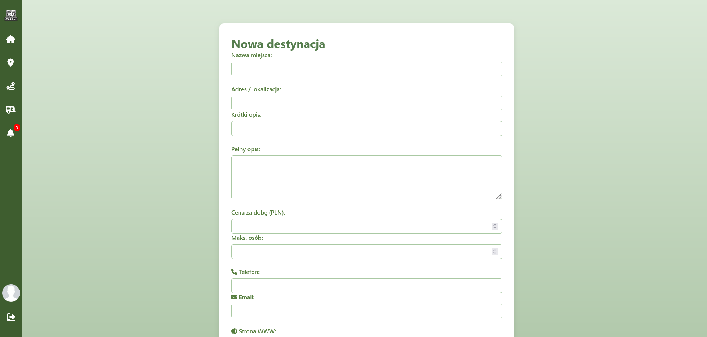
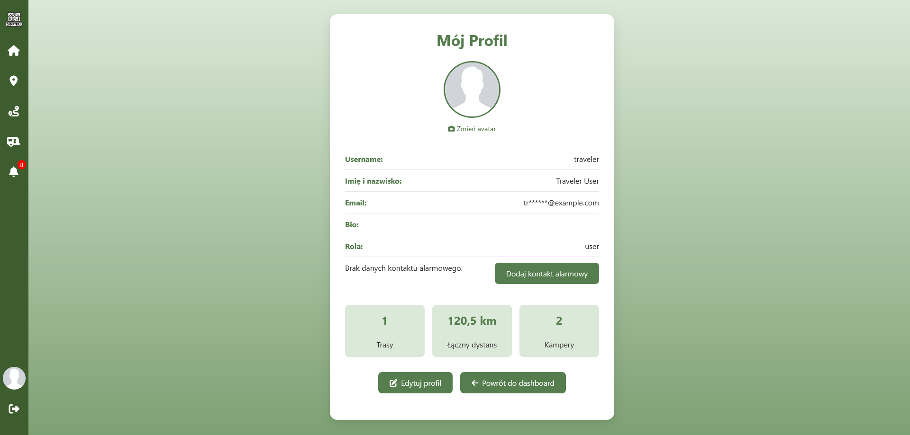
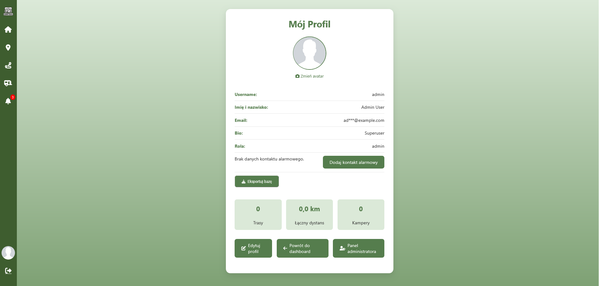
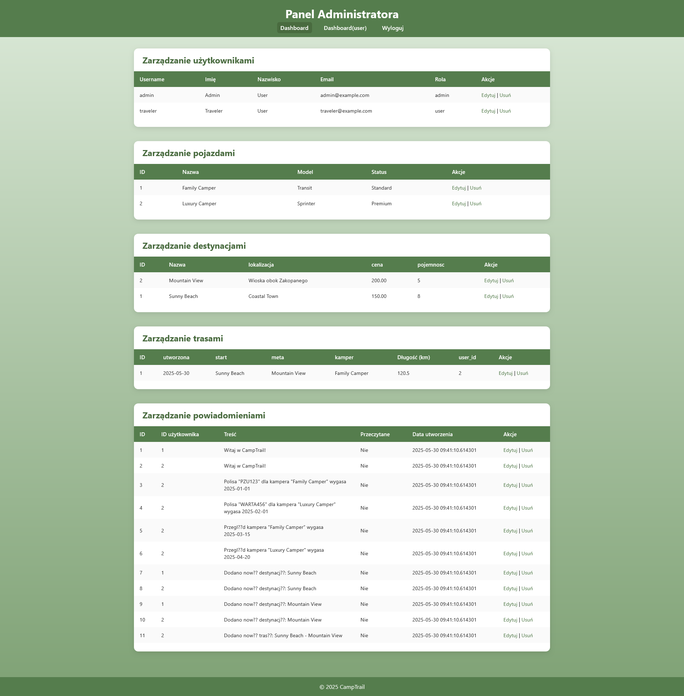

# Camptrail

## Przegląd projektu

Camptrail to dedykowana aplikacja webowa do zarządzania wyprawami kempingowymi. Umożliwia:

* rejestrację i logowanie użytkowników,
* definiowanie tras i przypisywanie kamperów do tras,
* zarządzanie miejscami docelowymi,
* obsługę powiadomień i kontaktów alarmowych.

Projekt zrealizowano w czystym PHP 8+, z wykorzystaniem PostgreSQL, konteneryzacją w Dockerze oraz serwerem Nginx.

## Kluczowe funkcje

* **Autoryzacja i uwierzytelnianie**: rejestracja, logowanie, resetowanie hasła.
* **RBAC**: role i uprawnienia weryfikowane w czasie rzeczywistym.
* **CRUD modułów**:

  * Kampery (Campers) – zarządzanie pojazdami kempingowymi,
  * Miejsca docelowe (Destinations),
  * Trasy (Routes),
  * Powiadomienia (Notifications),
  * Kontakty alarmowe (Emergency Contacts).
* **Dashboard statystyk**: podsumowania i wykresy aktywności i tras.
* **Upload plików**: zdjęcia awatarów i dokumenty.
* **Responsywny interfejs**: dostosowany do urządzeń mobilnych i desktop.

## Zabezpieczenia

* **Hashowanie haseł**: bcrypt z saltingiem w `src/Repositories/UserRepository.php` i `src/Controllers/AuthController.php`.
* **Ochrona przed SQL Injection**: parametryzowane zapytania w (`src/Repositories/*Repository.php`).
* **Zapobieganie XSS**: funkcja `escape()` w `src/Core/View.php` używana w widokach.
* **Ochrona przed CSRF**: tokeny CSRF (`src/Core/CsrfToken.php`) oraz ukryte pola w formularzach.
* **Walidacja i sanitacja danych**: `src/Core/Validator.php` i reguły w kontrolerach.
* **Zarządzanie sesją**: `SessionManager.php` regeneruje identyfikator, ustawia timeout i zabezpieczenia ciasteczek.
* **HTTPS**: wymuszanie SSL w `docker/nginx/nginx.conf`.
* **Limity uploadu**: `client_max_body_size` w Nginx i `upload_max_filesize` w PHP-FPM.
* **Kontrola typów plików**: walidacja MIME w `src/Controllers/UploadController.php`, katalog `public/uploads` chroniony przed wykonaniem PHP.
* **Content Security Policy (CSP)**: nagłówki w konfiguracji Nginx.

## Scenariusze użycia

1. **Planowanie wyprawy**: tworzenie trasy i przypisywanie kamperów.
2. **Zarządzanie kamperami**: dodawanie, edycja, usuwanie pojazdów.
3. **Monitorowanie tras**: przegląd szczegółów i powiadomień.
4. **Obsługa alarmów**: szybki dostęp do kontaktów alarmowych.
5. **Historia tras**: raporty dystansu i czasu zakończonych tras.
6. **Przypomnienia**: automatyczne alerty o przeglądach technicznych i polisach.

## Typy modułów

* **Miejsca docelowe** (Destinations): definicja punktów początkowych i końcowych trasy.
* **Trasy** (Routes): historia przejazdów kamperami z metrykami dystansu i czasu.
* **Kampery** (Campers): dane pojazdów, terminy przeglądów i polis.
* **Powiadomienia** (Notifications): przypomnienia i alerty systemowe.
* **Statystyki** (Dashboard): metryki użytkownika (liczba tras, łączny dystans).
* **Profil** (User Profile): widok i edycja danych użytkownika.
* **Pomoc i FAQ**: często zadawane pytania i odpowiedzi.

## Struktura bazy danych

### Tabele

```
roles
permissions
role_permissions
users
campers
camper_images
destinations
amenities
destination_amenity
destination_images
routes
insurance
technical_inspection
notifications
emergency_contact
```

### Funkcje SQL

* `set_emergency_contact_updated_at()` – automatycznie aktualizuje kolumnę `updated_at`.
* `set_updated_timestamp()` – aktualizuje `updated_at` w tabelach `campers`, `destinations`, `routes`.
* `fn_add_notification(_user_id INTEGER, _message TEXT)` – dodaje wpis do `notifications`.

### Wyzwalacze (Triggers)

* `trg_emergency_contact_updated_at`: BEFORE UPDATE na `emergency_contact`.
* `trg_update_timestamp`: BEFORE UPDATE na `campers`, `destinations`, `routes`.
* `destinations_after_insert`: AFTER INSERT na `destinations` -> notyfikacja.
* `inspection_before_upsert`: BEFORE INSERT/UPDATE na `technical_inspection` -> notyfikacja.
* `policy_before_upsert`: BEFORE INSERT/UPDATE na `insurance` -> notyfikacja.
* `users_after_insert_welcome`: AFTER INSERT na `users` -> powitanie.
* `routes_after_insert_notify`: AFTER INSERT na `routes` -> notyfikacja.

### Widoki

* `camper_insurance_view` – dane polis kamperów.
* `camper_inspections_view` – historia przeglądów technicznych.
* `camper_view` – podstawowe dane pojazdu.
* `destination_full_details_view` – kompletne informacje o destynacji.
* `route_overview` – lista tras z najważniejszymi metrykami.
* `route_stats_monthly` – miesięczne statystyki tras.
* `route_stats_yearly` – roczne statystyki tras.
* `vw_user_credentials` – dane logowania użytkownika.
* `vw_user_profile` – profil użytkownika (avatar, preferencje).

### Przykładowe dane

* **Role**: `admin`, `user`.
* **Permissions**: `manage_users`, `manage_campers`, etc.
* **Użytkownicy**: konta testowe z rolami.
* **Kampery, destynacje, trasy**: przykładowe rekordy.

## Transakcje i audyt

* Procedura `prc__register_user` w transakcji o izolacji `READ COMMITTED`.
* Wyzwalacz `trg_log_changes` rejestruje zmiany w tabelach w `tb_audit_log`.

## Struktura projektu

```
Camptrail/
├─ docker/             # Dockerfile'y i konfiguracje
├─ public/             # Nginx-served
│  ├─ css/             # Style
│  ├─ js/              # Fetch API scripts
│  ├─ img/             # Grafiki
│  ├─ uploads/         # Pliki użytkowników
│  └─ views/           # Szablony PHP
├─ src/                # MVC (Model, View, Controller)
│  ├─ Core/            # Bazowe klasy (DB, Sesje, CSRF)
│  ├─ Controllers/     # Obsługa żądań
│  ├─ Models/          # Encje
│  ├─ Repositories/    # Dostęp do danych
│  └─ RouterConfig.php # Definicja ścieżek
├─ sql/                # Skrypty SQL (schemat, dane)
├─ init.sql            # Inicjalizacja bazy
├─ docker-compose.yml  # Orkiestracja usług
├─ index.php           # Front controller
├─ routing.php         # Routing
└─ src/config.php      # Ustawienia (PDO, sesje)
```

## Skrypty JavaScript i Fetch API

* `public/js/auth.js`: logowanie, rejestracja, reset hasła.
* `public/js/camper.js`: CRUD kamperów (`/api/campers`).
* `public/js/destination.js`: CRUD destynacji (`/api/destinations`).
* `public/js/route.js`: zarządzanie trasami (`/api/routes`).
* `public/js/notifications.js`: pobieranie i oznaczanie powiadomień.
* `public/js/profile.js`: edycja profilu i awatara.
* `public/js/faq.js`: wczytywanie sekcji FAQ.

## Eksport danych z konta administratora

Administrator (`role = admin`) może pobrać zrzut bazy danych:

1. Zaloguj się jako administrator.
2. Przejdź do **Profil → Eksport bazy danych**.
3. Kliknij **Eksportuj** — plik `db_export_<YYYY-MM-DD_HH-MM-SS>.sql` zostanie pobrany.

Implementacja: `ProfileController::exportDb()` uruchamia `pg_dump --no-owner --no-privileges`.

### Wyjaśnienie opcji `pg_dump`

* `--no-owner`  – pomija polecenia przypisania właścicieli obiektów.
* `--no-privileges` (alias `--no-acl`)  – pomija instrukcje GRANT/REVOKE (ACL).

## Instrukcje uruchomienia

1. Zainstaluj Docker i Docker Compose.
2. Sklonuj repozytorium:

   ```bash
   git clone <repo-url>
   cd Camptrail
   ```
3. Zbuduj i uruchom kontenery:

   ```bash
   docker-compose up --build
   ```
4. (opcjonalnie) Załaduj `init.sql` do bazy:

   ```bash
   type .\init.sql | docker exec -i kamper_db psql -U postgres -d kamper_app
   ```
##Schemat bazy danych




Zrzuty ekranu aplikacji CampTrail

##1. Autentykacja

Logowanie


Rejestracja


Reset hasła


##2. Trasy

Strona główna


Dashboard


Twoje trasy


Dodawanie trasy


Edycja trasy


Widok trasy


##3. Pojazdy

Przegląd pojazdów


Dodawanie kampera


Edycja kampera


Szczegóły pojazdu


##4. Destynacje

Lista destynacji


Dodawanie destynacji


##5. Profil

Mój profil


Edycja profilu


Mój profil admin


##6. Inne

Powiadomienia

Panel administratora
## Autor

* Bartosz Filipak

